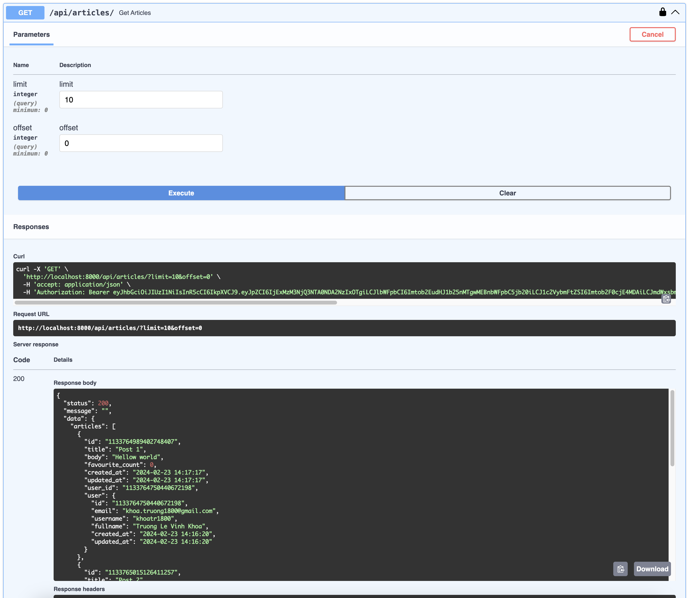

# opswat-mono-repos

This is mono repos for User + Article Management

## Software Specification:

- python 3.12.0+ or NodeJS 18.15.0+
- SQLModel for ORM
- Database (Postgres 15+)
- FastAPI for backend server
- Fontend ReactJS + Material UI

## Source Architecture

### Summary

- Apply Clean Architecture and DDD for back-end source
- For Font-end source architecture, apply Atom design pattern

### Details:

**Back-end Source**

- **configs**: Contains the configuration files for services.
- **logs**: Stores information and error logs.
- **scripts**: Stores scripts for creating tables in PostgreSQL and other related scripts.
- **src**: Main source for the backend.
  - **app**: Follows a layers architecture. Contains the source code for communicating with clients and forwarding requests to lower layers. Includes:
    - **controllers**: Contains service controllers such as auth, reaction, user, and article. Each folder contains a main file, `__index__.py`, responsible for directing each endpoint to the respective controller (e.g., `create_article_controller`, `update_article_controller`). Each file in this folder handles one endpoint.
    - **dtos**: Each file represents an entity, containing the parameters and responses for each endpoint. Parameters refer to data from the client, while responses refer to data returned from lower layers to the app.
    - **middlewares**: Houses all middlewares of the system.
    - **presenters**: Represents the data returned for client requests.
  - **domain**: Contains services, repositories, and entities for the business layer.
    - **entity**: Represents the state of data used in this layer, facilitating communication between repositories and services.
    - **services**: Handles specific services for each domain, such as article and user services.
    - **repositories**: Communicates with infrastructures such as MySQL, PostgreSQL, and other data storages, abstracting the details of the data storage. For example, although MySQL is used in this scenario, transitioning to PostgreSQL is feasible without altering the business logic.
  - **infrastructures**: Facilitates communication with infrastructures such as MySQL, PostgreSQL, and other data storages.

**Font-end Source**

- **apis**: all APIs needed for requesting the server
- **components**: separate components as the Atom Design Patterns, including:
  - **atoms**
  - **molecules**
  - **organisms**
  - **templates**
  - **pages**
- **constants**:
- **hooks**:
- **utils**:

## System initialization

### Start docker containers

```bash
docker-compose -f docker-compose.yml up -d
```

### Start Back-end service

1. Create virtual environment for python
2. Start this virtual environment and install required packages
   ```bash
   pip3 install -r requirements.txt
   ```
3. Start BE Service
   ```bash
   ENV=dev python3 -m uvicorn main:app --reload
   ```

### Start Font-end service

1. Install npm required dependencies
   ```bash
   yarn install
   ```
1. Start FE Service
   ```bash
   yarn start
   ```

### Access Swagger for API documentation

1. Access the Swagger URL for API documentation at [http://localhost:8000/docs](http://localhost:8000/docs)
   
   
2. Create User Account at API **POST /api/users**
   
3. Login for API at **Authorize** button
   
4. After login successfully, we can check remaining authenticated APIs
   
